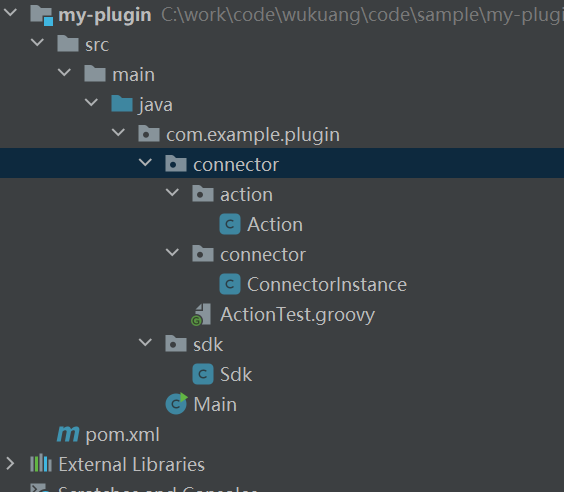
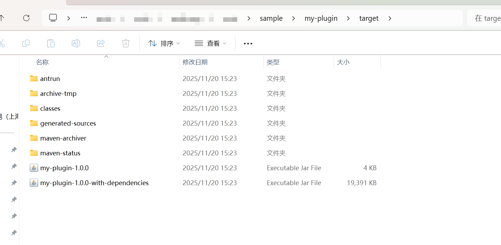

# 📦 项目说明

此项目是用于 **生成 SDK** 和 **SDK-Connector** 的模板工程。通过 Maven
Archetype，可以快速创建标准化的插件开发项目结构。

------------------------------------------------------------------------

## 🚀 使用方法

确保已完成以下准备工作：

-   已安装 **Maven**
-   已拉取并安装本地的 **ceta-archetype-plugin** 项目

------------------------------------------------------------------------

## 🔧 Step1 --- 安装模板项目

在 `ceta-archetype-plugin` 项目根目录执行：

``` bash
mvn install
```

------------------------------------------------------------------------

## 🔧 Step2 --- 生成新插件项目

在任意目录执行以下命令：

``` bash
mvn archetype:generate \
    -DgroupId=xxx \
    -DartifactId=xxx \
    -Dversion=xxx \
    -Dpackage=xxx \
    -DarchetypeArtifactId=ceta-archetype-plugin \
    -DarchetypeGroupId=com.ceta \
    -DarchetypeVersion=1.0-SNAPSHOT

```

------------------------------------------------------------------------

## 📘 参数说明

  ------------------------------------------------------------------------
参数                                描述
  ----------------------------------- ------------------------------------
`-DgroupId`                         目标项目的 **groupId**

`-DartifactId`                      目标项目的 **artifactId**

`-Dversion`                         目标项目版本号

`-Dpackage`                         项目基础包名`<br>`{=html}⚠️ **不能以
`com.ceta`
开头，否则会导致编译和运行错误！**
  ------------------------------------------------------------------------

------------------------------------------------------------------------

## 📝 示例

以下命令会生成一个名为 `my-plugin` 的插件项目：

``` bash
mvn archetype:generate \
    -DgroupId=com.example \
    -DartifactId=my-plugin \
    -Dversion=1.0.0  \
    -Dpackage=com.example.plugin \
    -DarchetypeArtifactId=ceta-archetype-plugin \
    -DarchetypeGroupId=com.ceta \
    -DarchetypeVersion=1.0-SNAPSHOT

```

------------------------------------------------------------------------

## 📁 Step3 --- 生成后的项目结构

执行命令后，会在当前目录生成项目：

    my-plugin/

（见图）\


------------------------------------------------------------------------

## 🏗️ Step4 --- 开发并打包插件

开发完成后，在项目根目录执行：

``` bash
mvn clean package
```

打包完成后，在 `target/` 目录下会生成：

    my-plugin-1.0.0-with-dependencies.jar

（见图）\


------------------------------------------------------------------------

## 🎉 完成！

您已经成功基于模板构建了一个可用的 SDK / SDK-Connector
插件项目。现在可以继续进行功能开发或发布插件！
