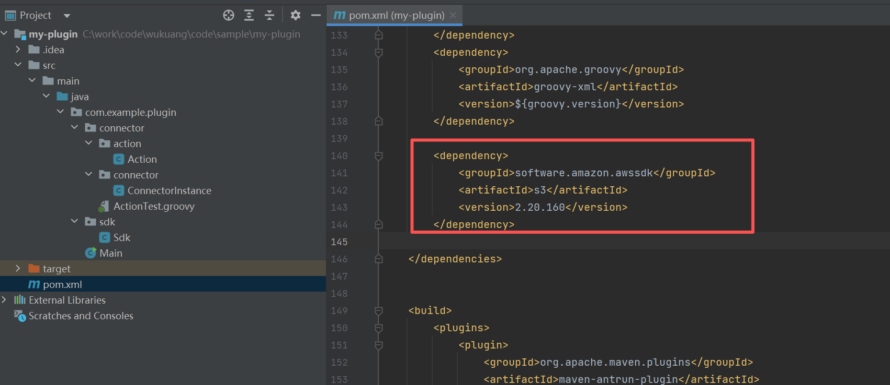
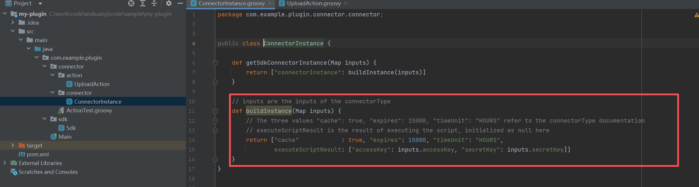
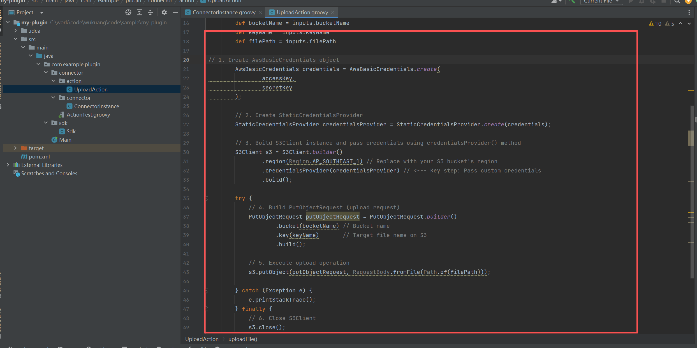
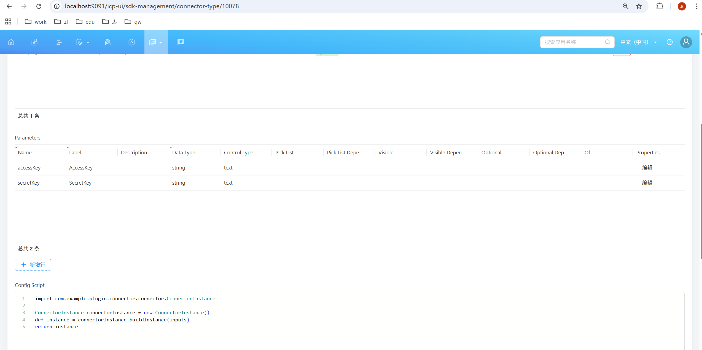
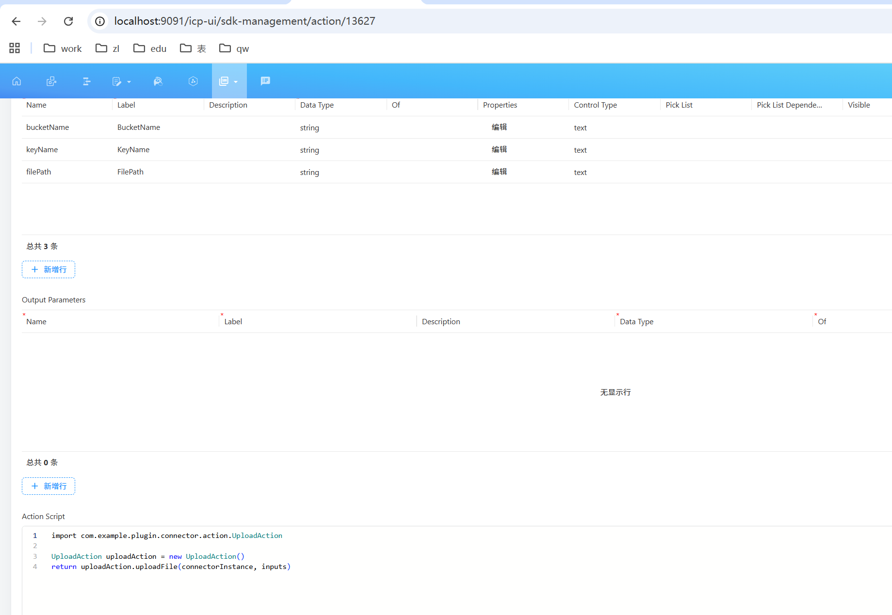
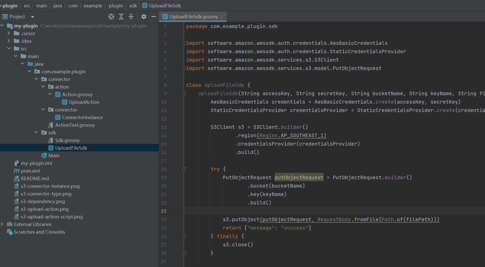
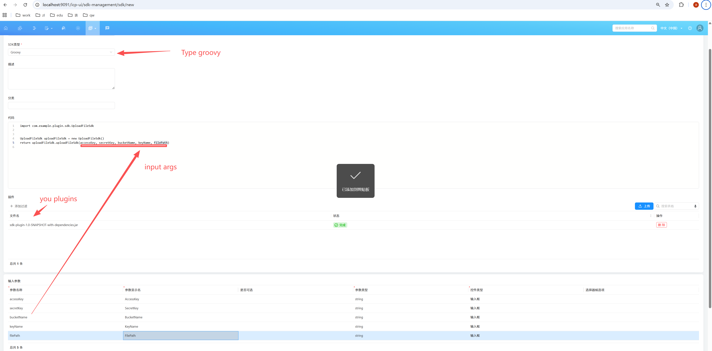

# 🚀 插件开发指南

> **提示：**
> 您可以在当前项目下自由编写和扩展插件代码。本指南将帮助您规范、安全地进行插件开发。

------------------------------------------------------------------------

## 🔒 核心配置限制（禁止修改）

为保证插件稳定性，请 **不要修改** 以下内容：

### ❌ Groovy 版本依赖（`pom.xml`）

- **原因：** 更改会导致插件运行时错误，影响执行环境兼容性。

### ❌ 已有 `<plugin>` 配置（`pom.xml`）

- **原因：** 修改已存在插件配置，可能导致构建失败或运行异常。

------------------------------------------------------------------------

## ✅ 允许的安全修改（可以添加）

在不影响核心配置的前提下，您可以：

- 在 `<dependencies>` 中 **新增依赖**
- 在 `<plugins>` 中 **新增插件配置**

> 💡 注意：只能添加，不能修改或删除已有关键配置。

------------------------------------------------------------------------

## sdk-connector📘 插件开发步骤

### \### Step 1 --- 在 `pom.xml` 添加所需依赖

例如，若需要与 S3 交互，可以添加：

``` xml
<dependency>
    <groupId>software.amazon.awssdk</groupId>
    <artifactId>s3</artifactId>
    <version>2.20.160</version>
</dependency>
```

如图


------------------------------------------------------------------------

### \### Step 2 --- 在 `${package}.connector.connector` 创建 ConnectorInstance

> **⚠️ 注意**：为了性能,请尽量使用缓存，`cache`,`expires`,`timeUnit`在http-connector篇有介绍。

示例：

``` java
package com.example.plugin.connector.connector;

public class ConnectorInstance {

  def getSdkConnectorInstance(Map inputs) {
    return ["connectorInstance": buildInstance(inputs)]
  }

  // inputs are the inputs of the connectorType
  def buildInstance(Map inputs) {
    // The three values "cache": true, "expires": 15000, "timeUnit": "HOURS" refer to the connectorType documentation
    // executeScriptResult is the result of executing the script, initialized as null here
    return [
        "cache": true,
        "expires": 15000,
        "timeUnit": "HOURS",
        executeScriptResult: [
            "accessKey": inputs.accessKey,
            "secretKey": inputs.secretKey
        ]
    ]
  }
}
```

如图

------------------------------------------------------------------------

### \### Step 3 --- 在 `${package}.connector.action` 创建具体 Action

示例：上传文件到 S3

``` java
package com.example.plugin.connector.action;

import software.amazon.awssdk.auth.credentials.AwsBasicCredentials;
import software.amazon.awssdk.auth.credentials.StaticCredentialsProvider;
import software.amazon.awssdk.services.s3.S3Client;
import software.amazon.awssdk.services.s3.model.PutObjectRequest;

class UploadAction {

    // connectorInstance is the return value of ConnectorInstance.buildInstance
    // inputs are the inputs of the action
    def uploadFile(connectorInstance, inputs) {
    def accessKey = connectorInstance.executeScriptResult.accessKey
    def secretKey = connectorInstance.executeScriptResult.secretKey

    AwsBasicCredentials credentials = AwsBasicCredentials.create(accessKey, secretKey)
    StaticCredentialsProvider credentialsProvider = StaticCredentialsProvider.create(credentials)

    S3Client s3 = S3Client.builder()
            .region(Region.AP_SOUTHEAST_1)
            .credentialsProvider(credentialsProvider)
            .build()

    try {
      PutObjectRequest putObjectRequest = PutObjectRequest.builder()
              .bucket(inputs.bucketName)
              .key(inputs.keyName)
              .build()

      s3.putObject(putObjectRequest, RequestBody.fromFile(Path.of(inputs.filePath)))
    } finally {
      s3.close()
    }
  }
}
```

如图


------------------------------------------------------------------------

## 🧩 在 CETA 中如何调用？

### ① 创建 ConnectorType

``` java
import com.example.plugin.connector.connector.ConnectorInstance

ConnectorInstance connectorInstance = new ConnectorInstance()
//inputs are the inputs of the connector
def instance = connectorInstance.buildInstance(inputs)
return instance
```

如图

------------------------------------------------------------------------

### ② 创建 Action

``` java
import com.example.plugin.connector.action.UploadAction

UploadAction uploadAction = new UploadAction()
//connectorInstance is the return value of ConnectorInstance.buildInstance
//inputs are the inputs of the action
return uploadAction.uploadFile(connectorInstance, inputs)

```

如图


## 🎉 你在flow中可以调用该action


------------------------------------------------------------------------

## groovy-sdk📘 插件开发步骤

### \### Step 1 --- 在 `pom.xml` 添加所需依赖

例如，若需要与 S3 交互，可以添加：

``` xml
<dependency>
    <groupId>software.amazon.awssdk</groupId>
    <artifactId>s3</artifactId>
    <version>2.20.160</version>
</dependency>
```

如图

------------------------------------------------------------------------

### \### Step 2 --- 在 `${package}.sdk` 创建 Sdk


示例：

``` java
package com.example.plugin.sdk

import software.amazon.awssdk.auth.credentials.AwsBasicCredentials
import software.amazon.awssdk.auth.credentials.StaticCredentialsProvider
import software.amazon.awssdk.services.s3.S3Client
import software.amazon.awssdk.services.s3.model.PutObjectRequest

class UploadFileSdk {
    uploadFileSdk(String accessKey, String secretKey, String bucketName, String keyName, String filePath) {
        AwsBasicCredentials credentials = AwsBasicCredentials.create(accessKey, secretKey)
        StaticCredentialsProvider credentialsProvider = StaticCredentialsProvider.create(credentials)

        S3Client s3 = S3Client.builder()
                .region(Region.AP_SOUTHEAST_1)
                .credentialsProvider(credentialsProvider)
                .build()

        try {
            PutObjectRequest putObjectRequest = PutObjectRequest.builder()
                    .bucket(bucketName)
                    .key(keyName)
                    .build()

            s3.putObject(putObjectRequest, RequestBody.fromFile(Path.of(filePath)))
            return ["message": "success"]
        } finally {
            s3.close()
        }

    }
}

```

如图


------------------------------------------------------------------------

## 🧩 在 CETA 中如何调用？

### ① 创建 Groovy Sdk

核心代码
``` java

import com.example.plugin.sdk.UploadFileSdk


UploadFileSdk uploadFileSdk = new UploadFileSdk()
return uploadFileSdk.uploadFileSdk(accessKey, secretKey, bucketName, keyName, filePath)

```
如图


## 🎉 你在flow中可以调用该groovy sdk

------------------------------------------------------------------------

## 🎉 完成！

您现在已经掌握插件开发的核心流程，包括依赖添加、Connector 构建、Action
执行,Groovy sdk 与 CETA 中的调用方式。

如需帮助，可随时继续扩展或询问。
